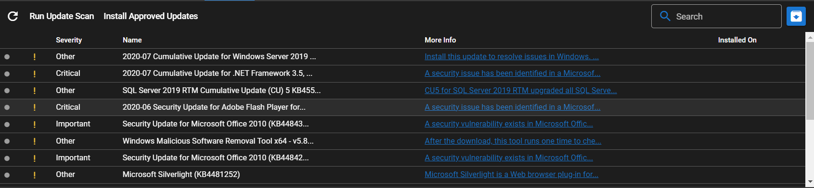
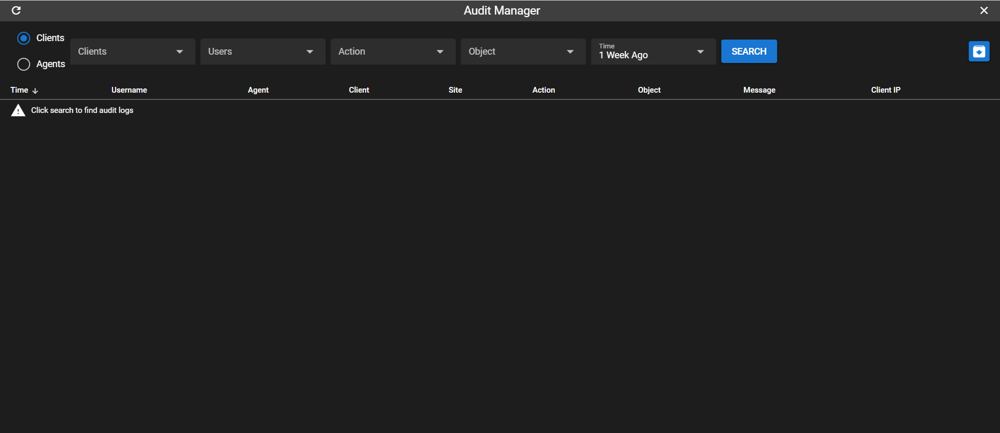
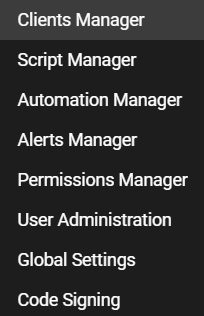
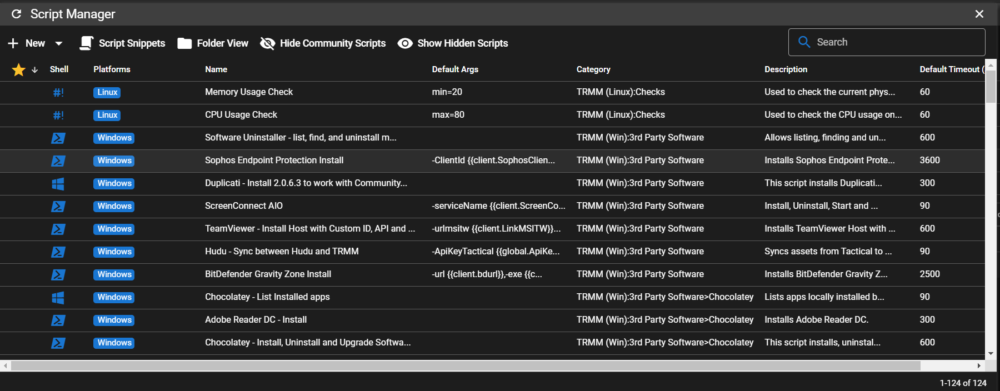

# TacticalRMM-functional combing

[TacticalRMM-functional combing](#tacticalrmm-functional-combing)  
 [Device operation](#device-operation)  
  [Summary](#summary)  
  [Checks](#checks)  
  [Tasks](#tasks)  
  [Patches](#patches)  
  [Software](#software)  
  [History](#history)  
  [Assets](#assets)  
  [Audit](#audit)  
 [Agents](#agents)  
 [Logs](#logs)  
 [Tools](#tools)  
  [Bulk operation](#bulk-operation)  
  [Bulk Patch Management](#bulk-patch-management)  
  [Server Maintenance](#server-maintenance)  
 [Settings](#settings)  
 [Help](#help)

## Device operation

### Summary

Output hardware information, hardware check status and disks information

### Checks

Output the result of maintenance script

Show run history

Show last output history

### Tasks

Output situation of tasks working(Only support on Windows)

### Patches

Output patches situation of Windows(Only support on Windows)

### Software

Software installed information of system(Only support on Windows)

### History

Output history of script work

### Assets

Output device assets

Include: CPU, Memory, USB, BIOS etc.

(Only support on windows)

### Audit

Audit user's action on device

## Agents

Agents management

about agents install/update/manage

## Logs

Output admin operations log

## Tools

Support Bulk operation(script or command) and essential operation and
maintenance platform

### Bulk operation

### Bulk Patch Management

Support patches scan of bulk of Windows machine

### Server Maintenance

## Settings

The settings of system

Public script manage

## Help

Support information

