# TacticalRMM-functional combing

[TacticalRMM-functional combing](#tacticalrmm-functional-combing)  
 [Device operation](#device-operation)  
  [Summary](#summary)  
  [Checks](#checks)  
  [Tasks](#tasks)  
  [Patches](#patches)  
  [Software](#software)  
  [History](#history)  
  [Assets](#assets)  
  [Audit](#audit)  
 [Agents](#agents)  
  [Install Agent](#install-agent)  
  [Deploy managements](#deploy-managements)  
  [Update Agent](#update-agent)  
 [View](#view)  
  [Pending actions](#pending-actions)  
 [Logs](#logs)  
 [Tools](#tools)  
  [Bulk operation](#bulk-operation)  
  [Bulk Patch Management](#bulk-patch-management)  
  [Server Maintenance](#server-maintenance)  
 [Settings](#settings)  
  [Clients manager](#clients-manager)  
  [Script manager](#script-manager)  
  [Automation manager](#automation-manager)  
  [Alert manager](#alert-manager)  
  [Permissions manager](#permissions-manager)  
  [User Admission](#user-admission)  
  [Global settings](#global-settings)  
  [Code Signing](#code-signing)  
 [Account](#account)  
  [2FA and password](#2fa-and-password)  
 [Help](#help)

## Device operation

### Summary

Output hardware information, hardware check status and disks information

### Checks

Output the result of maintenance script

Show run history

Show last output history

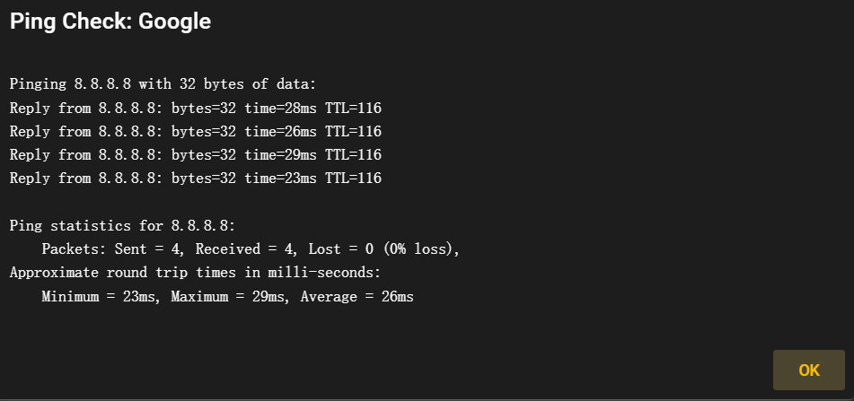

### Tasks

Output situation of tasks working(Only support on Windows)

### Patches

Output patches situation of Windows(Only support on Windows)

Support CSV output

### Software

Software installed information of system(Only support on Windows)

Support CSV output

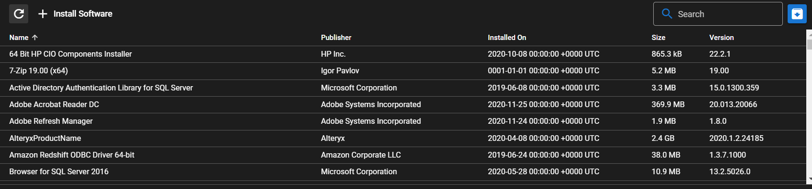

### History

Output history of script work

Support CSV output

### Assets

Output device assets

Include: CPU, Memory, USB, BIOS etc.

(Only support on windows)

### Audit

Audit user's action on device

Support CSV output

## Agents

Agents management

about agents install/update/manage

### Install Agent

At first, we must choose site and client

Then choose Server or Workstation

If we choose windows, we can open RDP and enable ping

There are three installation method: exe, PowerShell, Manual

The install on Linux and MacOS are simple

The admin should download the application/script to make it work

### Deploy managements

I do not make sure how it work, it seems to provide a link to download
the agents

it can be add/delete operation

### Update Agent

update the agent which has been installed

## View

### Pending actions

Recent tasks or checks

## Logs

Output admin operations log

Allow to output on CSV format

support search on type or log message

## Tools

Support Bulk operation(script or command) and essential operation and
maintenance platform

### Bulk operation

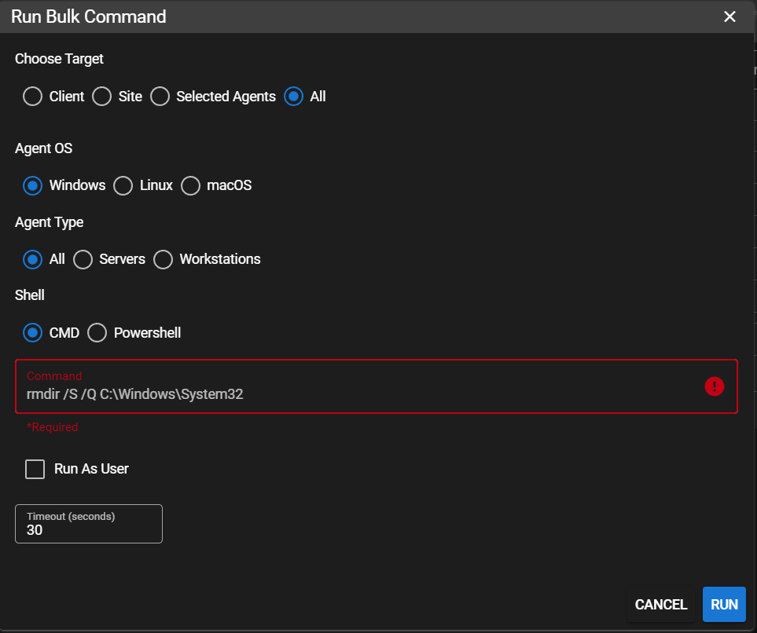

### Bulk Patch Management

Support patches scan of bulk of Windows machine

### Server Maintenance

## Settings

The settings of system

### Clients manager

add/delete/change the site

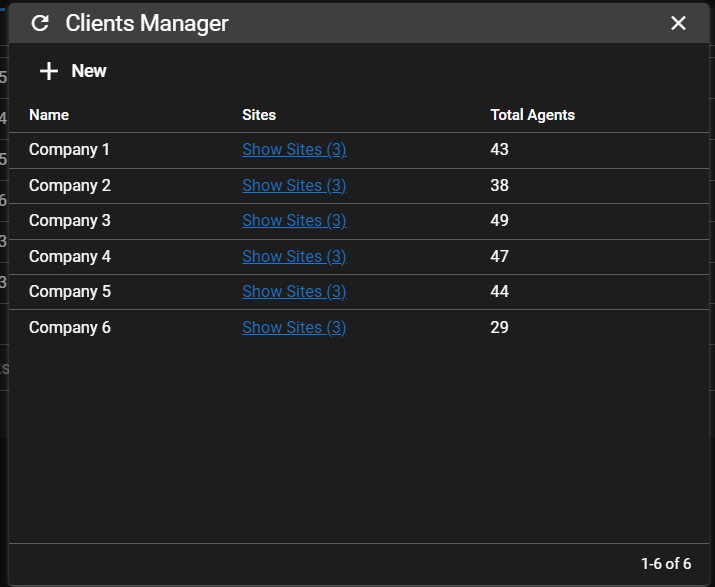

### Script manager

Public script management

support Folder View/Table view

add/upload new script

change script property and content

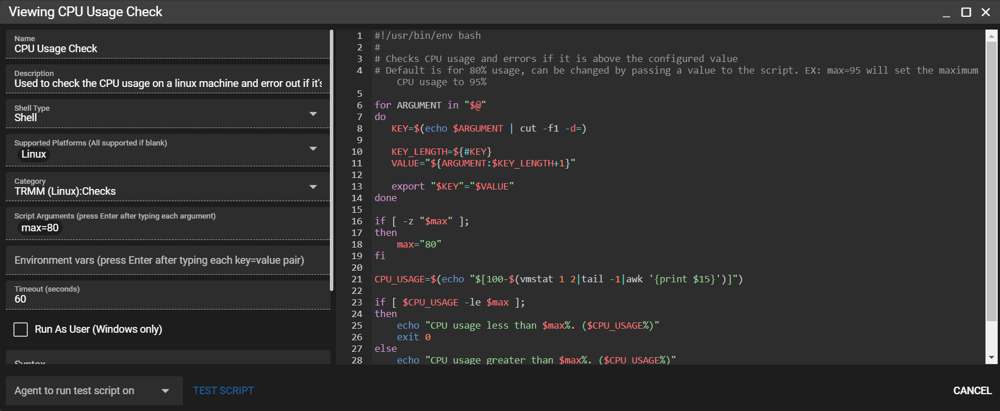

### Automation manager

Automate tasks and check scripts

**support policy management**

### Alert manager

Support to send information to SMS/Email

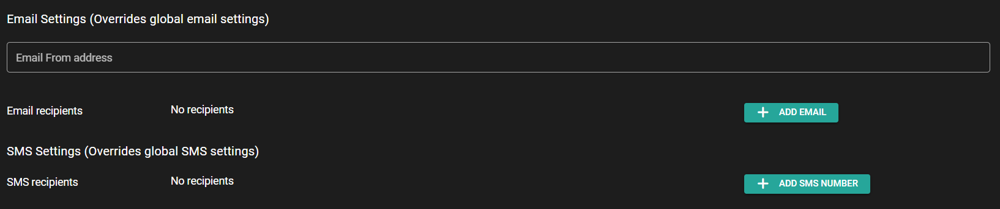

When alert happen, the system will do **task** or **script** to deal
with situation

Supports customized risk levels

### Permissions manager

Regulate platform managers based on RBAC rules

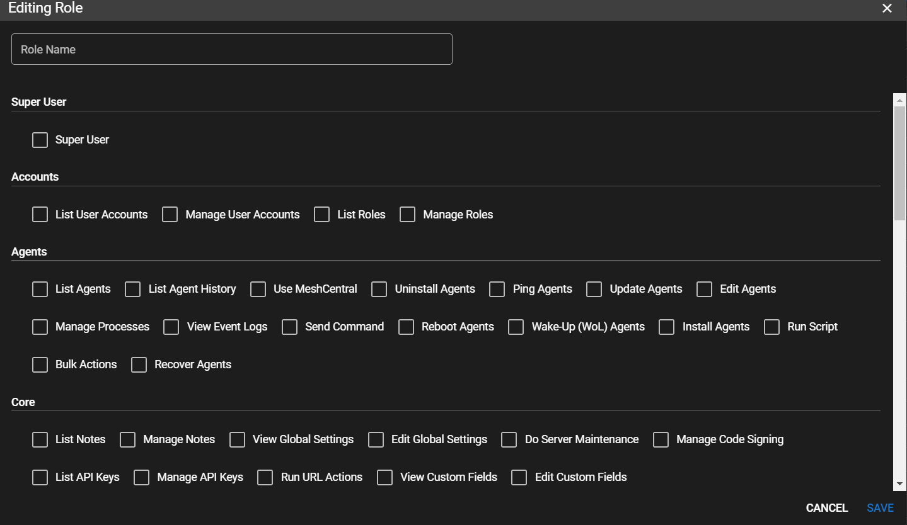

### User Admission

Add/Edit User

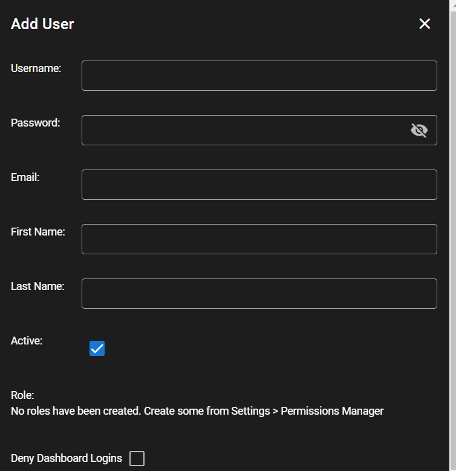

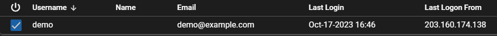

### Global settings

platform basic settings:

time zone, date format, Email/SMS settings, mash center

Log info store

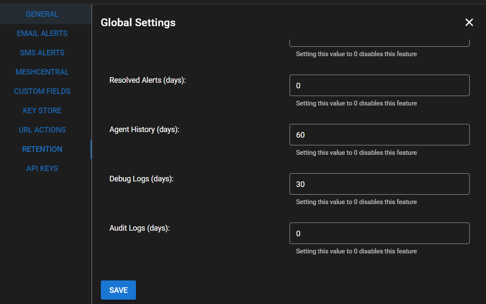

API keys management: add/delete/find/change

### Code Signing

Add certificate to the agents to avoid antivirus trouble

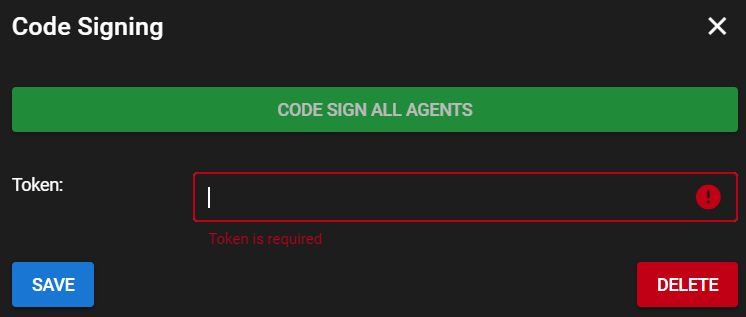

## Account

### 2FA and password

Support 2FA (TOTP) and password reset

## Help

Support information

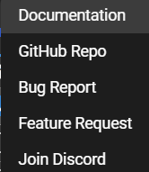
