# TacticalRMM-functional combing

[TOC]

## Device operation

### Summary

Output hardware information, hardware check status and disks information

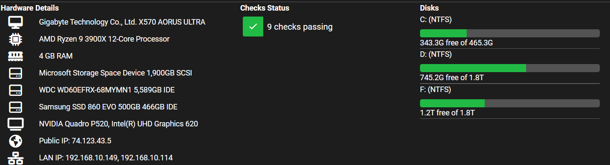

### Checks

Output the result of maintenance script 

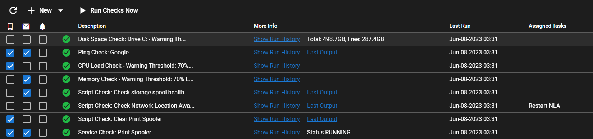

Show run history

Show last output history

### Tasks

Output situation of tasks working(Only support on Windows)

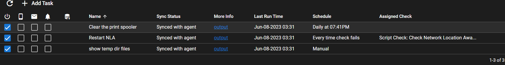

### Patches

Output patches situation of Windows(Only support on Windows)

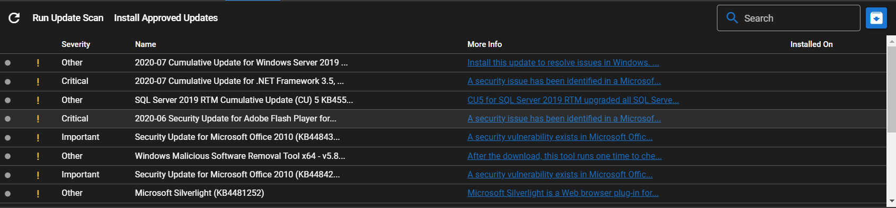

### Software

Software installed information of system(Only support on Windows)

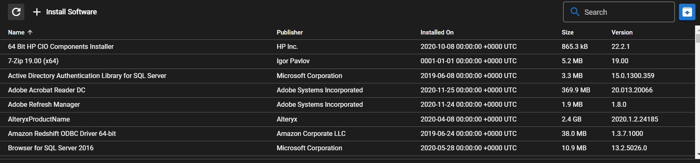

### History

Output history of script work

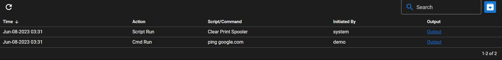

### Assets

Output device assets

Include: CPU, Memory, USB, BIOS etc.

(Only support on windows)

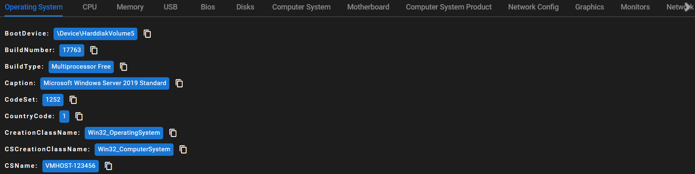

### Audit

Audit user's action on device

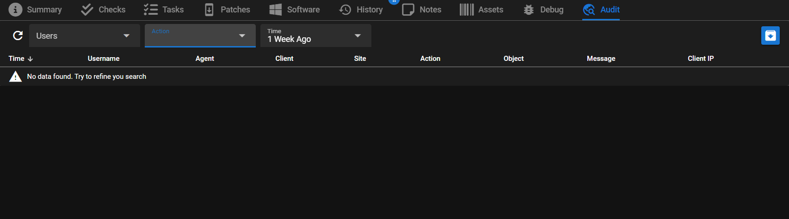

## Agents

Agents management

about agents install/update/manage

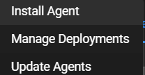

## Logs

Output admin operations log

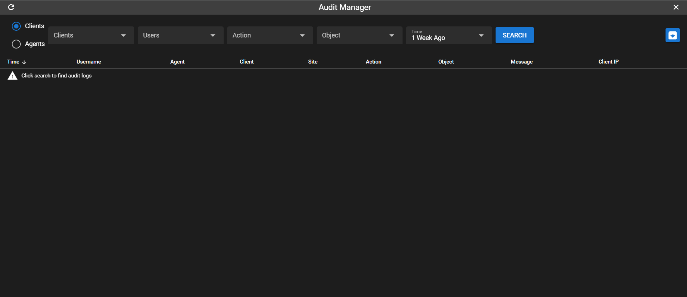

## Tools

Support Bulk operation(script or command) and  essential operation and maintenance platform

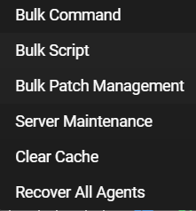

## Settings

The settings of system

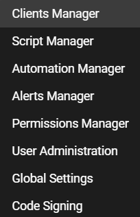

Public script manage

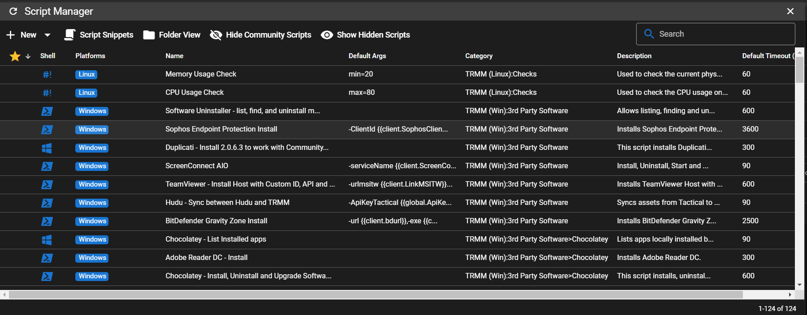

## Help

Support information

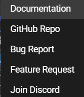